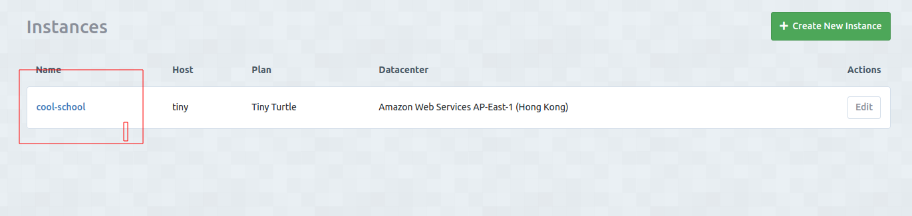
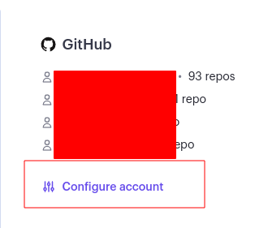
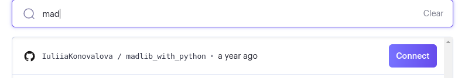
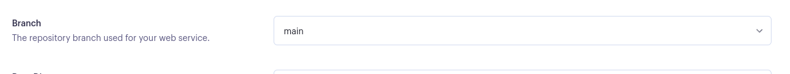
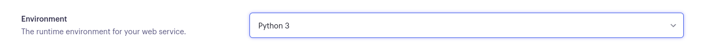
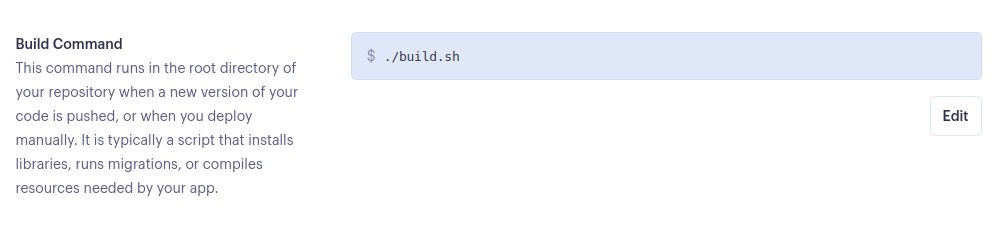

# Deployment instructions for the project


- The program was deployed to [Heroku](https://dashboard.heroku.com) initially then moved to [Render](https://render.com/).
- The program can be reached by the [link](https://issue-tracker-mnl3.onrender.com/)

---
## Local deployment:

*Note:*
  - This project requires install all the requirements:
  - Open the terminal window and type:
  - `pip3 install -r requirements.txt`

Create a local copy of the GitHub repository by following one of the two processes below:

- Download ZIP file:
  1. Go to the [GitHub Repo page](https://github.com/IuliiaKonovalova/issue_tracker).
  1. Click the Code button and download the ZIP file containing the project.
  1. Extract the ZIP file to a location on your PC.

- Clone the repository:
  1. Open a folder on your computer with the terminal.
  1. Run the following command
  - `git clone https://github.com/IuliiaKonovalova/issue_tracker.git`

- Alternatively, if using Gitpod, you can click below to create your own workspace using this repository.

  [](https://gitpod.io/#https://github.com/IuliiaKonovalova/issue_tracker)

---

1. Create a .gitignore file in the root directory of the project where you should add env.py and __pycache__ files to prevent the privacy of your secret data.

1. Create a .env file. This will contain the following environment variables:

    ```python
    import os

      os.environ("SECRET_KEY", "Add a secret key")
      os.environ("DATABASE_URL", "will be used to connect to the database")
    ```

1. Run following commands in a terminal to make migrations: 
    - `python3 manage.py makemigrations`
    - `python3 manage.py migrate`
1. Create a superuser to get access to the admin environment.
    - `python3 manage.py createsuperuser`
    - Enter required information (your username, email and password).
1. Run the app with the following command in the terminal:
    - `python3 manage.py runserver`
1. Open the link provided in a browser to see the app.

1. If you need to access admin page:
    - Add /admin/ to the link provided.
    - Enter your username and password (for the superuser that you have created before).
    - You will be redirected to the admin page.

---

**The app was initially deployed to Heroku then moved to Render since Heroku has removed its free tier services from November 29 2022**

---


## Heroku Deployment

1. Set up a local workspace on your computer for Heroku:
    - Create a list of requirements that the project needs to run:
      - type in this in the terminal: `pip3 freeze > requirements.txt`
    - Commit and push the changes to GitHub
    
1. Go to [www.heroku.com](www.heroku.com) 
1. Login or create a Heroku account.
1. Create a new app with any unique name <name app>.
1. Create a Procfile in your local workplace, which will contain the following:
    ```python
        web: gunicorn <name app>.wsgi:application
    ```
    - Commit and push the changes to GitHub.

1. Go to resources in Heroku and search for postgresql. Select Hobby dev - Free and click on the provision button to add it to the project.

1. Go to the settings app in Heroku and go to Config Vars. Click on Reveal Config Vars and add the following config variables:

| Key      | Value          |
|-------------|-------------|
| DATABASE_URL | ... | 
| DISABLE_COLLECTSTATIC | 1 |
| EMAIL_HOST_PASS | ... |
| EMAIL_HOST_USER | ... |
| HEROKU_HOSTNAME | ... |
| SECRET_KEY | ... |


1. Copy the value of DATABASE_URL and input it into the .env file.
1. Create EMAIL_HOST_PASS and EMAIL_HOST_USER with gmail account and add values to these keys.
1. Migrate changes.
1. Set debug to False in settings.py
1. Commit and push the changes to GitHub.

---


## Render Deployment

### Create Database on ElephantSQL

1. Go to [ElephantSQL](https://www.elephantsql.com/) and create a new account.

2. Create a new instance of the database.

    - 

3. Select a name for your database and select the free plan.

    - 

4. Click "Select Region"

    - 

5. Select a region close to you.

    - 

6. Click "Review"

    - 

7. Click "Create Instance"

    - 

8. Click on the name of your database to open the dashboard.

    - 

9. You will see the dashboard of your database. You will need the URL of your database to connect it to your Django project.

    - 

---

### Create a new app on Render

Link to the deployed application on Render: [Cool School](https://cool-school.onrender.com/)

1. Create a new Render account if you don't already have one here [Render](https://render.com/).

2. Create a new application on the following page here [New Render App](https://dashboard.render.com/), choose **Webserver**:

    - 

3. Select the GitHub option and connect the application to the repository you created.

    - 

4. Search for the repository you created and click "Connect."

    - 

    - 

5. Create name for the application

    - 

6. Select the region where you want to deploy the application.

    - 

7. Select branch to deploy.

    - 

8. Select environment.

    - 

9. Render build command: `./build.sh`

    - 

10. Render start command: `daphne <NAME OF YOUR APP>.asgi:application --port $PORT --bind 0.0.0.0 -v2` + You can delete `Procfile` from your repository.

    - 

11. Select Free plan.

    - 

12. Click on "Advanced" settings.

    - 

13. Add the following environment variables:

    | Key      | Value          |
    |-------------|-------------|
    | WEB_CONCURRENCY | 4 |
    | DATABASE_URL | ************* |
    | SECRET_KEY | ************* |
    | DEBUG | False |
    | EMAIL_HOST_USER | ************* |
    | EMAIL_HOST_PASS | ************* |
    | DISABLE_COLLECTSTATIC | 1 |
    | CLOUDINARY_URL | ************* |
    | CLOUDINARY_CLOUD_NAME | ************* |
    | CLOUDINARY_API_KEY | ************* |
    | CLOUDINARY_API_SECRET | ************* |
    | STRIPE_CURRENCY | ************* |
    | STRIPE_PUBLIC_KEY | ************* |
    | STRIPE_SECRET_KEY | ************* |
    | STRIPE_ENDPOINT_SECRET | ************* |

    *DATABASE_URL value is takes from ElephantSQL dashboard, SECRET_KEY value is takes from your local env.py file, DEBUG value is set to False, EMAIL_HOST_USER and EMAIL_HOST_PASSWORD values are takes from your Gmail account. STRIPE_CURRENCY, STRIPE_PUBLIC_KEY, STRIPE_SECRET_KEY, STRIPE_ENDPOINT_SECRET values are takes from your Stripe account. CLOUDINARY_URL, CLOUDINARY_CLOUD_NAME, CLOUDINARY_API_KEY, CLOUDINARY_API_SECRET values are takes from your Cloudinary account.*


14. Open VS Code and create a new file called `build.sh` in the root directory of your project.

    - 

15. Copy the following code into the `build.sh` file:

    ```bash
      set -o errexit
      pip install -r requirements.txt
      python manage.py collectstatic --noinput
      python manage.py makemigrations && python manage.py migrate
    ```

    -*pip install -r requirements.txt installs the packages detailed in your requirements.txt file.*
    - *python manage.py collectstatic collects all static files to allow them to be served in the production environment.*
    - *The –noinput flag allows the command to run with no additional input from the deploying developer.*
    - *python manage.py makemigrations && python manage.py migrate are run to ensure all migrations are made to your production database.*

16. Save the file `build.sh`.

17. Go to `settings.py` file and add the following code to add Render.com to allowed hosts:

    ```python
        RENDER_EXTERNAL_HOSTNAME = os.environ.get('RENDER_EXTERNAL_HOSTNAME')
        if RENDER_EXTERNAL_HOSTNAME:
            ALLOWED_HOSTS.append(RENDER_EXTERNAL_HOSTNAME)
    ```

   *If you have heroku in your allowed hosts, delete it*

18. Save the file `settings.py`.

19. Go to `env.py` and change to DATEBASE_URL value to the one you got from ElephantSQL.

    ```python
        os.environ["DATABASE_URL"] = '*************'
    ```

20. Create a superuser for your database.

    ```bash
        python manage.py createsuperuser
    ```

21. Commit and push the changes to GitHub.

22. Go back to Render and click "Create Web Service."

    - 

23. Wait for the completion of the deployment.

24. Go to admin panel and change the settings for the admin by assigning a role of `Boss` to allow the full control of the website including role assignment.

---