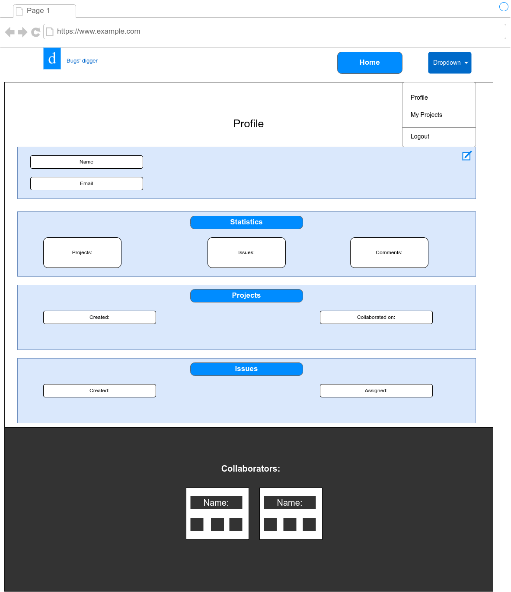

# Django issue tracker

---
## About
This [issue tracker](https://issue-tracker-by-konovalovs.herokuapp.com/) was created to help people to create and track issues in their personal or team projects. It is a simple and easy to use issue tracker that allows you to register your account, create projects, issues, add comments, and track the status of your issues.

---
## Wireframes
### Home page

### Login page

### Register page

### Profile page

### Projects page

### Project page

### Issue page
