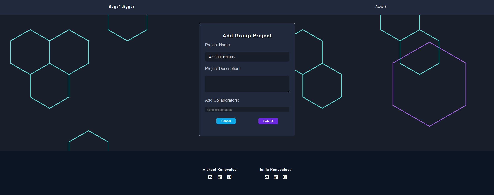
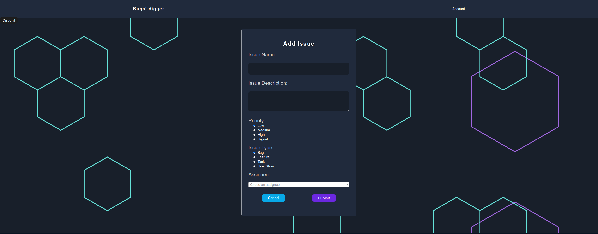
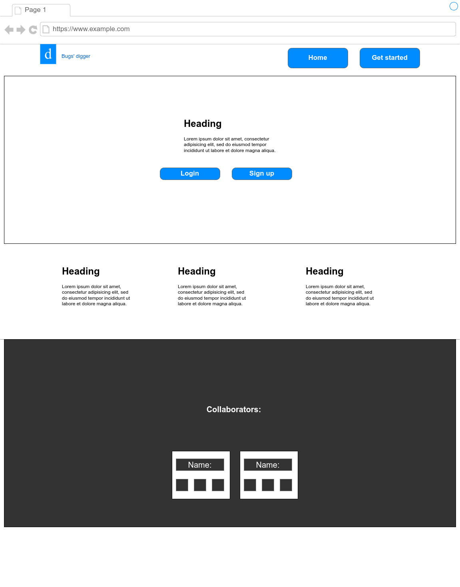
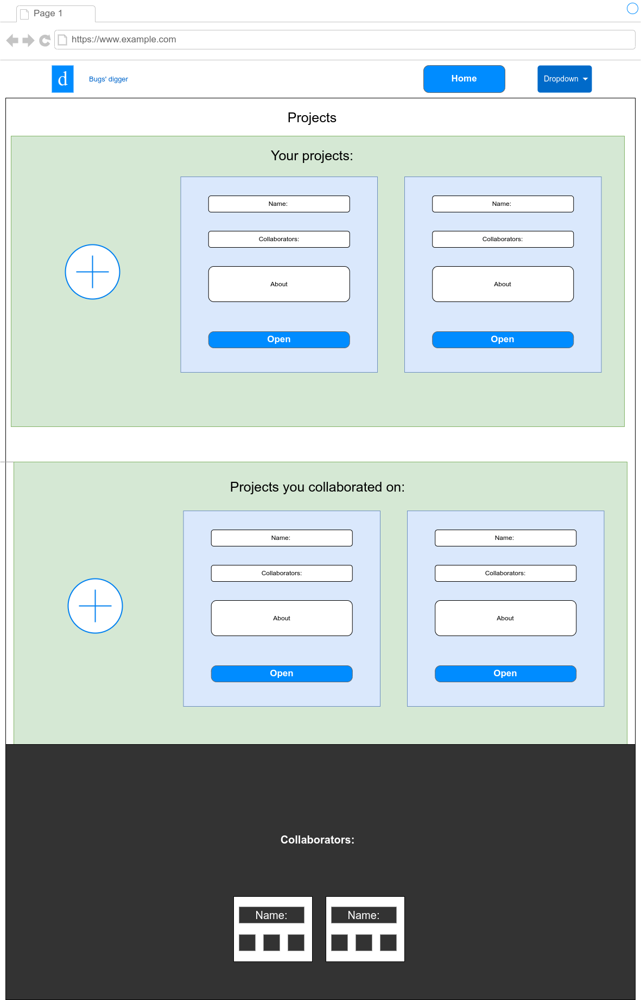

# Django issue tracker


## About

This [issue tracker](https://issue-tracker-by-konovalovs.herokuapp.com/) was created to help people to create and track issues in their personal or team projects. It is a simple and easy to use issue tracker that allows you to register your account, create projects, issues, add comments, and track the status of your issues.

---

## User stories

### First Time Visitor Goals:

1. As a **First Time Visitor**, I want to **easily understand the main purpose of the app**, so I can **learn more about this app**.

1. As a **First Time Visitor**, I want to **be able to easily navigate through the app**, so I can **find the content**.

1. As a **First Time Visitor**, I want to be able to **register my account**, so I can **learn benefits of the app as a user**.

1. As a **First Time Visitor**, I want to **find the app useful**, so I can **use it according to my needs**.

### Registered User Goals:

1. As a **Registered User**, I want to **be able to log in to my account**, so I can **have a personal account**.

1. As a **Registered User**, I want to **be able easily login and logout**, so I can **access my personal account information**.

1. As a **Registered User**, I want to **be able easily recover my password in case I forget it**, so I can **recover access to my account**.

1. As a **Registered User**, I want to **be able change my password**, so I can **be sure that nobody else can access my account**.


1. As a **Registered User**, I want to **be able to create a personal project**, so I can **keep track of my progress**.

1. As a **Registered User**, I want to **be able to create a team project**, so I can **work on a project along with other developers**.

1. As a **Registered User**, I want to be able **safely work on projects with my team**, so I can **be sure that only my team has access to this project**.

1. As a **Registered User**, I want to **be able to add collaborators to my team project**, so I can **choose with which people I will work with**.

1. As a **Registered User**, I want to **be able to create issues for a project**, so I can **increase productivity of my or team work**.

1. As a **Site User**, I want to be able to **comment on the issue created**, so I can **add some additional Registered on the bug**.

1. As a **Registered User**, I want to **be able to track and change the status or type of an issue, so I can **see the status or type of an issue**.

1. As a **Registered User**, I want to be able to **upvote an issue**, so I can **show that I have the same issue as someone has already posted**.

1. As a **Registered User**, I want to **be able to use an interactive kanban board inside projects**, so I can **easily apply changes to the issues**.

1. As a **Site User**, I want to be able to **comment on the issue created**, so I can **add some additional information on the bug, feature, task, or user story**.

1. As a **Registered User**, I want to **be able to edit or delete my projects, issues, comments, and votes**, so I can **be sure that I can apply any changes t my notes**.

1. As a **Registered User**, I want **to be able to see the list of all projects I created or am a collaborator of**, so I can **understand on which project I should work on**.

1. As a **Registered User**, I want to **be able to see the list of all issues I created or I was assigned to**, so I can **understand on which issue I should track or I have to work on**.

1. As a **Registered User**, I want to **be able to view other users' profiles**, so I can **learn about other users' activity**.

---

## Features

1. Landing page

   - When you visit the site, you will see a landing page with a welcome message and buttons to register or log in.

   

1. Sign up

   - When you click the "Sign up" button, you will be redirected to a sign up page. After filling out the form, you will need to confirm your email address.

   

   - You can register a new account by filling in the form and clicking the "Sign up" button.

1. Log in

   - When you click the "Login" button, you will be redirected to a log in page.

   

   - You can log in to your account by filling in the form and clicking the "Sign in" button.

   - If you forgot your password, you can reset it by clicking the "Forgot password?" button. You will be redirected to a page where you can enter your email address and click the "Reset password" button.


1. Projects list

   - After you log in, you will be redirected to the projects list page.

   

   - You can see a list of all projects you created or are a collaborator of.
   - You can click on a large plus button to create a new project. You will be given a choice of personal or team projects.

   

1. Create project

   - When you choose the type of project you want to create, you will be redirected to a create project page.

     - Personal project form:

     

     - Team project form:

     

1. Project details

   - After you click on a project, you will be redirected to the project details page. Here you can see all the information about the project and an interactive kanban board to work on the issues. From here you can to go to each collaborator's profile page, create and manage issues, and edit and delete the project if you created it.

   

   - You can click on "add issue" to create an issue for the project, you'll be redirected to a create issue page, where you can add a title, description, choose its priority and type, and add assignee.

   

1. Project edit page

   - After you click on the edit button, you will be redirected to the project edit page. Here you can edit the project name, description, and choose the type of project.

   

   This page has pre-filled fields with the current project information, which the user may easily edit depending on the type of the project (personal or team project). It also has 2 buttons: "Submit" and "Cancel". If the user clicks "Submit", the project will be updated. If the user clicks "Cancel", the project will not be updated and the user will be redirected to the project details page.

1. Project delete page

    - After you click on the delete button, you will be redirected to the project delete page. Here you can delete the project.
  
    
  
    This page has a button "Delete" and a button "Cancel". If the user clicks "Delete", the project will be deleted and the user will be redirected to the projects list page. If the user clicks "Cancel", the project will not be deleted and the user will be redirected to the project details page.

1. Issue details

   - After you click on an issue, you will be redirected to the issue details page. Here you can see all the information about the issue, including the comments and the status of the issue. From here you can to go to creator's and assignee's profile pages, add and edit comments, and edit and delete the issue if you created it.

   

1. Issue edit page

    - After you click on the edit button, you will be redirected to the issue edit page. Here you can edit the issue title, description, and choose the priority and type of the issue.
  
    
  
    This page has pre-filled fields with the current issue information, which the user may easily edit depending on the type of the issue (bug, feature, task, or user story). It also has 2 buttons: "Submit" and "Cancel". If the user clicks "Submit", the issue will be updated. If the user clicks "Cancel", the issue will not be updated and the user will be redirected to the issue details page.


1. Issue delete page

    - After you click on the delete button, you will be redirected to the issue delete page. Here you can delete the issue.
  
    
  
    This page has a button "Delete" and a button "Cancel". If the user clicks "Delete", the issue will be deleted and the user will be redirected to the project details page. If the user clicks "Cancel", the issue will not be deleted and the user will be redirected to the issue details page.

1. Profile page

    - You can go to your profile page by clicking on "Profile" in the account menu at the top right corner of the page. Also, you can visit other users' profile pages by clicking on their names in the projects list or issue details pages.
    
    - Here you can see users' information and their statistics.

    

    - If you are on your profile page, you can also see a password change form at the bottom of the page.

    


---

## Technologies used

- ### Languages:
    
    + [Python 3.8.5](https://www.python.org/downloads/release/python-385/): the main language used to develop the server side of the website.
    + [JS](https://www.javascript.com/): the main language used to develop the client side of the website.
    + [HTML](https://developer.mozilla.org/en-US/docs/Web/HTML): the markup language used to create the website.
    + [CSS](https://developer.mozilla.org/en-US/docs/Web/css): the styling language used to style the website.

- ### Frameworks and libraries:

    + [Django](https://www.djangoproject.com/): python framework used to create all the logic.
    + [jQuery](https://jquery.com/): was used to control click events and sending AJAX requests.
    + [jQuery User Interface](https://jqueryui.com/) was used fto create interactive elements, such as the kanban board.
    + [Select2](https://select2.org/): was used to create the dropdown menus.

- ### Databases:

    + [SQLite](https://www.sqlite.org/): was used as a development database.
    + [PostgreSQL](https://www.postgresql.org/): the database used to store all the data.

- ### Other tools:

    + [Git](https://git-scm.com/): the version control system used to manage the code.
    + [Pip3](https://pypi.org/project/pip/): the package manager used to install the dependencies.
    + [Gunicorn](https://gunicorn.org/): the web server used to run the website.
    + [Spycopg2](https://www.python.org/dev/peps/pep-0249/): the database driver used to connect to the database.
    + [Django-allauth](https://django-allauth.readthedocs.io/en/latest/): the authentication library used to create the user accounts.
    + [Django-crispy-forms](https://django-cryptography.readthedocs.io/en/latest/): was used to control the rendering behavior of Django forms.
    + [Heroku](https://dashboard.heroku.com/): the hosting service used to host the website.
    + [GitHub](https://github.com/): used to host the source code of the website.
    + [VSCode](https://code.visualstudio.com/): the IDE used to develop the website.
    + [Chrome DevTools](https://developer.chrome.com/docs/devtools/open/): was used to debug the website.
    + [Font Awesome](https://fontawesome.com/): was used to create the icons used in the website.
    + [Draw.io](https://www.lucidchart.com/) was used to make a flowchart for the README file.
    + [Coolors](https://coolors.co/202a3c-1c2431-181f2a-0b1523-65e2d9-925cef-6b28e0-ffffff-eeeeee) was used to make a color palette for the website.
    + [BGJar](https://www.bgjar.com/): was used to make a background images for the website.
    + [W3C Validator](https://validator.w3.org/): was used to validate HTML5 code for the website.
    + [W3C CSS validator](https://jigsaw.w3.org/css-validator/): was used to validate CSS code for the website.
    + [JShint](https://jshint.com/): was used to validate JS code for the website.
    + [PEP8](https://pep8.org/): was used to validate Python code for the website.

---
## Design

The designed was inspired by the [GitHub](https://github.com/).
The decision on the design scheme came from the idea of simplicity, visual hierarchy, consistency, navigation, and a sense of community.
The color palette was chosen to be consistent on the website and inspired by modern trend to make the website more user-friendly.

The background images was chosen to be consistent with the color palette and reduce user's destruction from the main content of the website.

---
## Testing

Please refer to the [TESTING.md](TESTING.md) file for all test related documentation.

---

## Deployment

- The program was deployed to [Heroku](https://dashboard.heroku.com).
- The program can be reached by the [link](https://issue-tracker-by-konovalovs.herokuapp.com/)
### Local deployment:

*Note:*
  - This project requires install all the requirements:
  - Open the terminal window and type:
  - `pip3 install -r requirements.txt`

Create a local copy of the GitHub repository by following one of the two processes below:

- Download ZIP file:
  1. Go to the [GitHub Repo page](https://github.com/IuliiaKonovalova/issue_tracker).
  1. Click the Code button and download the ZIP file containing the project.
  1. Extract the ZIP file to a location on your PC.

- Clone the repository:
  1. Open a folder on your computer with the terminal.
  1. Run the following command
  - `git clone https://github.com/IuliiaKonovalova/issue_tracker.git`

- Alternatively, if using Gitpod, you can click below to create your own workspace using this repository.

  [](https://gitpod.io/#https://github.com/IuliiaKonovalova/issue_tracker)

---

1. Create a .gitignore file in the root directory of the project where you should add env.py and __pycache__ files to prevent the privacy of your secret data.

1. Create a .env file. This will contain the following environment variables:

    ```python
    import os

      os.environ("SECRET_KEY", "Add a secret key")
      os.environ("DATABASE_URL", "will be used to connect to the database")
    ```

1. Run following commands in a terminal to make migrations: 
    - `python3 manage.py makemigrations`
    - `python3 manage.py migrate`
1. Create a superuser to get access to the admin environment.
    - `python3 manage.py createsuperuser`
    - Enter required information (your username, email and password).
1. Run the app with the following command in the terminal:
    - `python3 manage.py runserver`
1. Open the link provided in a browser to see the app.

1. If you need to access admin page:
    - Add /admin/ to the link provided.
    - Enter your username and password (for the superuser that you have created before).
    - You will be redirected to the admin page.


### Heroku Deployment

1. Set up a local workspace on your computer for Heroku:
    - Create a list of requirements that the project needs to run:
      - type in this in the terminal: `pip3 freeze > requirements.txt`
    - Commit and push the changes to GitHub
    
1. Go to [www.heroku.com](www.heroku.com) 
1. Login or create a Heroku account.
1. Create a new app with any unique name <name app>.
1. Create a Procfile in your local workplace, which will contain the following:
    ```python
        web: gunicorn <name app>.wsgi:application
    ```
    - Commit and push the changes to GitHub.

1. Go to resources in Heroku and search for postgresql. Select Hobby dev - Free and click on the provision button to add it to the project.

1. Go to the settings app in Heroku and go to Config Vars. Click on Reveal Config Vars and add the following config variables:

| Key      | Value          |
|-------------|-------------|
| DATABASE_URL | ... | 
| DISABLE_COLLECTSTATIC | 1 |
| EMAIL_HOST_PASS | ... |
| EMAIL_HOST_USER | ... |
| HEROKU_HOSTNAME | ... |
| SECRET_KEY | ... |


1. Copy the value of DATABASE_URL and input it into the .env file.
1. Create EMAIL_HOST_PASS and EMAIL_HOST_USER with gmail account and add values to these keys.
1. Migrate changes.
1. Set debug to False in settings.py
1. Commit and push the changes to GitHub.

---

## Credits

- [GitHub](https://github.com/) for giving the idea of the project's design.
- [Django](https://www.djangoproject.com/) for the framework.
- [BGJar](https://www.bgjar.com/): for the free access to background images build tool.
- [Font awesome](https://fontawesome.com/): for the free access to icons.
- [Heroku](https://www.heroku.com/): for the free hosting of the website.
- [jQuery](https://jquery.com/): for providing varieties of tools to make standard HTML code look appealing.

---
## Wireframes

### Home page



### Login page


### Register page


### Profile page


### Projects page



### Project page


### Issue page


