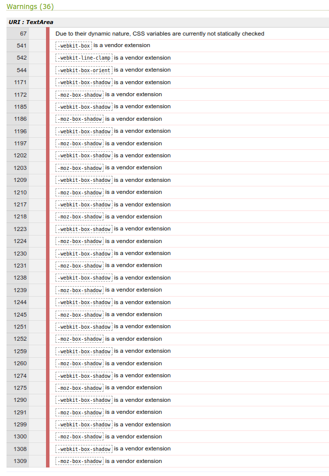
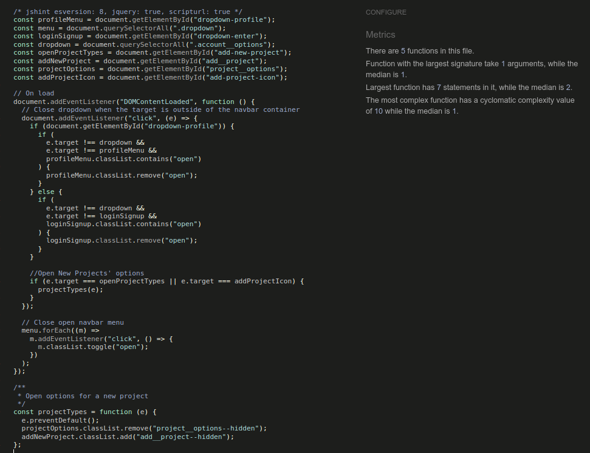

# Testing
---

## Validation

- ### HTML

    + [Official HTML validator](https://validator.w3.org/) was used to validate the HTML output. No errors were found.

- ### CSS

    + [Official CSS validator](https://jigsaw.w3.org/css-validator/) was used to validate the CSS output. No errors were found. However, 36 warnings were shown which have no impact on the website functionality.

    

- ### JavaScript

    + [Official JavaScript validator](https://jshint.com/) was used to validate the JavaScript output.

    
- ### Python

    + [PEP8 online validator](https://pep8online.com/) was used to validate the Python output. No errors were found.
    